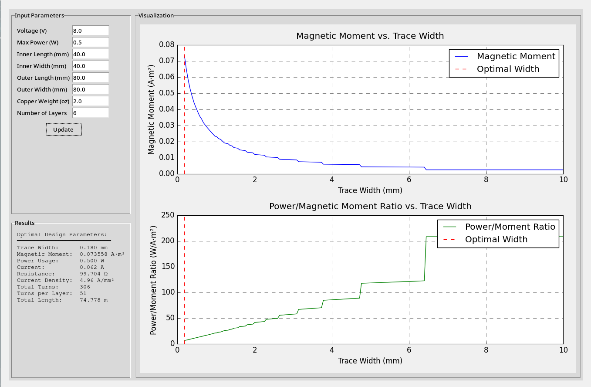
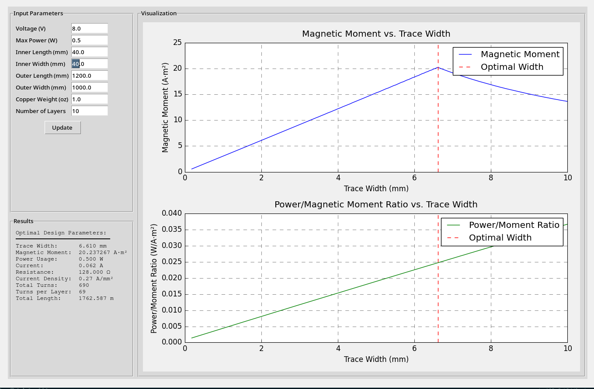

# Magnetorquer Optimization Tool

A tool for calculating the optimal trace width to maximize magnetic moment for PCB magnetorquer coils with various copper weights. This tool helps design optimal PCB-based magnetorquer coils by considering various constraints like trace width, spacing, current density, and power limitations.

## Screenshots of magnetorquer_optimize_with_graphics.py




## Overview

This repository contains two different versions of the magnetorquer optimization tool:

1. `magnetorquer_optimization.py` - Command line version with basic functionality
2. `magnetorquer_optimize_with_graphics.py` - GUI version with interactive graphs

## Prerequisites

- Python 3.7+
- Required Python packages:
  ```
  numpy
  scipy
  matplotlib
  ```

## Installation

1. Clone this repository:
   ```bash
   git clone https://github.com/yourusername/magtorque-optimization.git
   cd magtorque-optimization
   ```

2. Install required packages:
   ```bash
   pip install numpy scipy matplotlib
   ```

## Usage

### Command Line Version
Run the basic optimization script: (I recommend using the graphical onen as this one is outdated)
```bash
python magnetorquer_optimization.py
```
You'll be prompted to enter: 
- Voltage supplied (V)
- Max power (W)
- Inner length (mm)
- Inner width (mm)
- Outer length (mm)
- Outer width (mm)
- Copper weight (oz) (USE 2.0 OZ)
- Number of layers (USE 6.0)

### GUI Version
Run the graphical interface version:
```bash
python magnetorquer_optimize_with_graphics.py
```
This provides an interactive interface where you can:
- Adjust parameters in real-time
- View optimization graphs
- See immediate results of parameter changes

## Script Analysis

### Working Scripts:
1. `magnetorquer_optimization.py` (Command Line Version)
   - Most reliable version
   - Provides basic functionality
   - Gives consistent results

2. `magnetorquer_optimize_with_graphics.py` (GUI Version)
   - Working visualization
   - Includes real-time parameter updates
   - Some unit conversion inconsistencies but functional

### Known Limitations:
- All scripts assume uniform copper thickness
- Edge effects are not considered
- Thermal considerations are not included
- Magnetic field uniformity is not calculated

## Parameter Guidelines

- **Voltage**:
- **Power**:
- **Trace Width**: 
- **Trace Spacing**: 
- **Copper Weight**: 
- **Number of Layers**: Samwise - 6

## Contributing

Feel free to open issues or submit pull requests. Areas that need improvement:
1. Thermal analysis
2. Edge effect calculations
3. Better handling of non-square geometries
4. Manufacturing constraint validation

## License

MIT License - See LICENSE file for details
